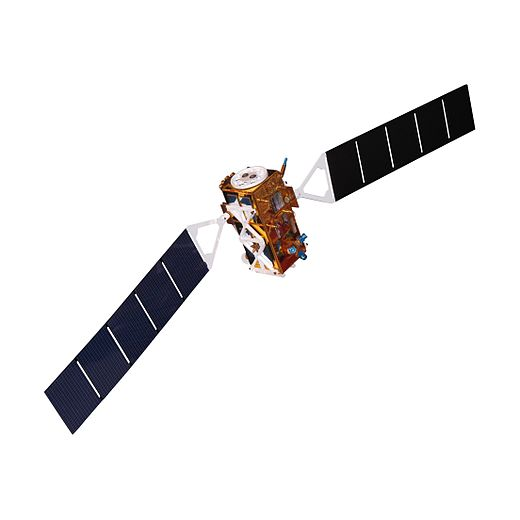
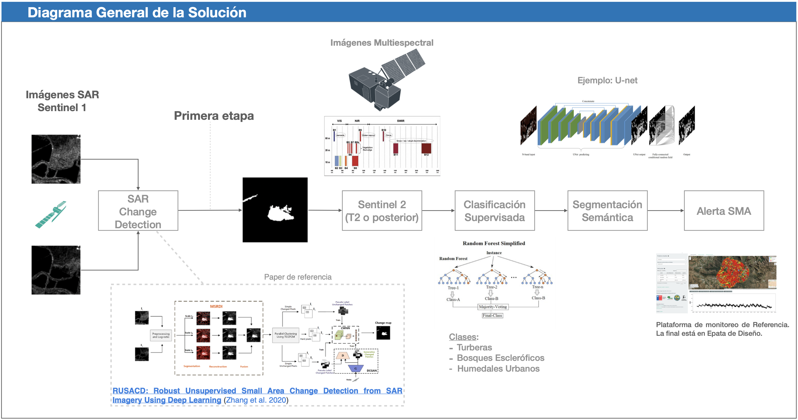

### Descripción del Poster:

In today's world, the degradation of natural systems represents one of the greatest challenges, and their conservation is crucial to protect them from human intervention. Given the diversity and climatic adversity of the geographical areas under study, Synthetic Aperture Radar (SAR) images will be used.

In Chile, the Superintendencia del Medio Ambiente (SMA) is responsible for ensuring compliance with environmental regulations. It faces a major challenge in trying to monitor all protected natural ecosystems, such as the peatlands in Chiloé.

The proposed solution involves the use of satellite imagery. SAR satellites can provide images during the day and night, regardless of weather conditions.

Since a monitoring system requires constantly capturing information and contrasting it with a historical record, computational efficiency and expert supervision are needed. Therefore, an unsupervised change detection algorithm is chosen in the first stage.

It is expected that, at the end of the first stage, a change detection system will be available for SAR satellite images using unsupervised convolutional neural networks. The resulting images (changes) will be evaluated using similarity or intersection metrics with real images of human intervention in natural ecosystems (Ground Truth). In addition, the results will be compared with other conventional change detection techniques.
