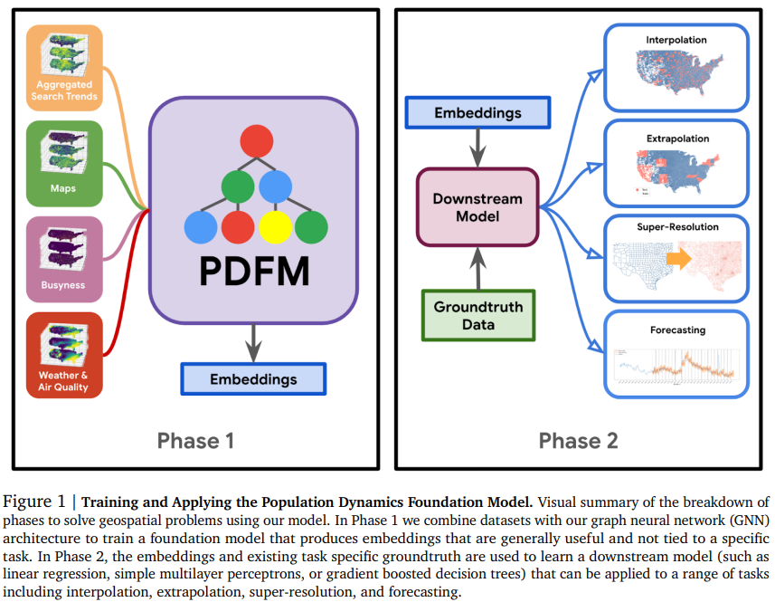
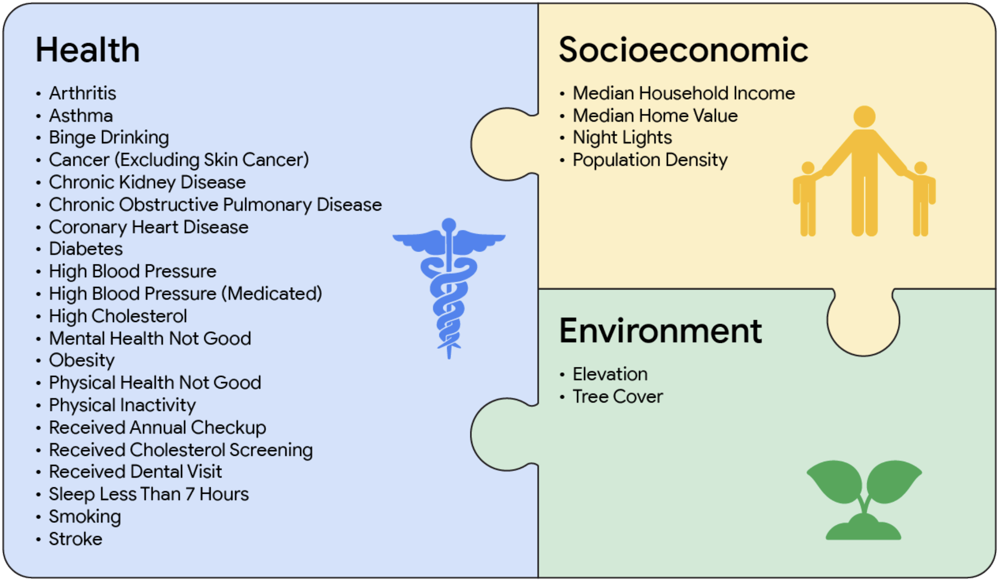

# PDFM: Representing Territory as a Context-Aware Vector

What if we could represent a territory as a vector rich in context, human behavior, and environmental interaction? The team at [Google Research](https://research.google/blog/insights-into-population-dynamics-a-foundation-model-for-geospatial-inference/) has developed the **Population Dynamics Foundation Model (PDFM)** — a geospatial foundation model that leverages **Graph Neural Networks (GNNs)** to generate territorial embeddings that capture the complexity of human, environmental, and socioeconomic systems.

## What Is the PDFM?

The **PDFM** is a foundation model designed to understand and forecast population dynamics through vector representations of geographic units, such as districts or census zones. It uses a graph-based deep learning architecture that integrates multiple sources of data:

- **Population data**: web search trends, mobility and foot traffic.
- **Environmental conditions**: air quality, vegetation, climate data.
- **Urban and socioeconomic metrics**: employment, income, access to services, healthcare infrastructure.

Each node in the graph represents a geographic region and connects to others based on spatial proximity or contextual similarity, allowing the model to capture complex interdependencies between places.

Research Paper: [https://arxiv.org/abs/2411.07207](https://arxiv.org/abs/2411.07207)

## Practical Applications

The PDFM has already shown strong performance across a range of geospatial tasks, including:

- **Geospatial interpolation and extrapolation** in areas with sparse data.
- **Spatial super-resolution**, inferring fine-grained values from low-resolution data.
- **Forecasting socioeconomic indicators** like unemployment or poverty when paired with time series models (e.g., TimesFM).

These capabilities make PDFM a powerful tool for urban planning, environmental management, public health, and disaster preparedness.

## Access and Implementation

One of PDFM’s biggest strengths is its openness. Google has released the model’s embeddings, training code, and usage examples — allowing researchers, city planners, and public agencies to plug them into their own geospatial models.

Official Repository: [https://github.com/google-research/population-dynamics](https://github.com/google-research/population-dynamics)

## PDFM in Crime Analysis and Urban Security

One of the most compelling applications of PDFM is in **urban crime analysis**. Traditional predictive crime models rely on past incident counts or time-based trends. PDFM introduces a richer approach: understanding **crime patterns through the structural context** of the urban environment.

Each spatial unit’s embedding encodes:

- **Structural vulnerability**: housing density, inequality, segregation.
- **Mobility networks**: pedestrian access, road networks, connectivity.
- **Environmental quality**: urban vegetation, heat exposure, public infrastructure.

This enables analysts to explain **why crimes cluster in certain areas**, going beyond heatmaps to uncover the hidden structural drivers of criminal vulnerability.

### From Hotspots to Structural Insights

PDFM helps transition from reactive mapping to proactive urban diagnosis:

- What socioeconomic and infrastructural features do crime-prone areas share?
- How do mobility patterns and disconnected neighborhoods relate to risk?
- Can we predict emerging hotspots based on latent vulnerability profiles?

Instead of treating high-crime zones uniformly, these embeddings help tailor security strategies based on **deep territorial context** — integrating police deployment with urban revitalization or social programs.

## Conclusion

PDFM marks a new era in geospatial modeling. It lets us think of a territory not just as coordinates on a map, but as a **contextual, intelligent entity** — encoded with social structure, behavioral dynamics, and environmental conditions.

For those working in public policy, urban safety, or environmental planning, this model unlocks deeper analytical power and smarter decision-making.

Want to explore how PDFM could be applied to your region or data? I'm actively working on these integrations — feel free to reach out!
